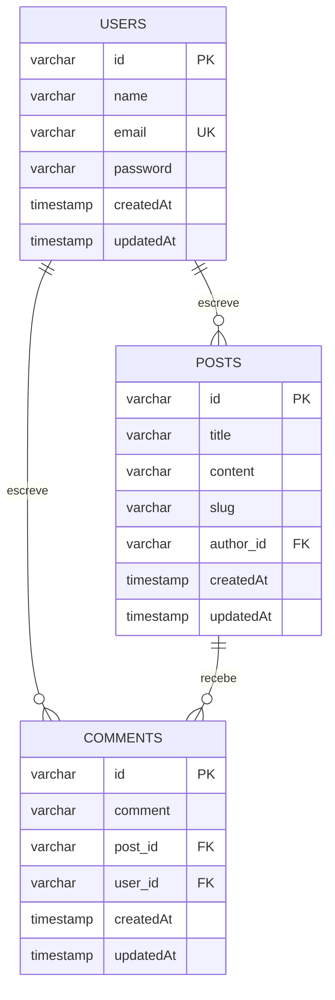

# API de Blog — Capacitação Backend UNECT


API RESTful de um blog desenvolvida no contexto da Capacitação Backend da UNECT, construída com NestJS, TypeORM e PostgreSQL.

A aplicação oferece cadastro e gerenciamento de usuários, autenticação baseada em JWT, publicação de posts e registro de comentários, seguindo a arquitetura modular recomendada pelo NestJS.

---

## Sumário

1. [Tecnologias](#1-tecnologias)
2. [Pré-requisitos](#2-pré-requisitos)
3. [Instalação e execução](#3-instalação-e-execução)
4. [Variáveis de ambiente](#4-variáveis-de-ambiente)
5. [Migrations](#5-migrations)
6. [Autenticação](#6-autenticação)
7. [Referência de rotas](#7-referência-de-rotas)
8. [Paginação](#8-paginação)
9. [Modelo de dados](#9-modelo-de-dados)
10. [Estrutura do projeto](#10-estrutura-do-projeto)
11. [Coleção do Postman](#11-coleção-do-postman)
12. [Referências](#12-referências)

---

## 1. Tecnologias

| Categoria       | Ferramenta                            |
| --------------- | ------------------------------------- |
| Runtime         | Node.js 20+                           |
| Framework       | NestJS 11 com TypeScript              |
| Banco de dados  | PostgreSQL 16                         |
| ORM             | TypeORM                               |
| Autenticação    | JWT, Passport (`passport-jwt`) e bcrypt |
| Validação       | class-validator e class-transformer   |
| Identificadores | UUID v7                               |
| Infraestrutura  | Docker e Docker Compose               |

---

## 2. Pré-requisitos

- Node.js 20 ou superior
- Docker e Docker Compose instalados

---

## 3. Instalação e execução

Clone o repositório e acesse o diretório do projeto:

```bash
git clone https://github.com/aqu1no1/capacitacao-backend-unect.git
cd capacitacao-backend-unect
```

Instale as dependências:

```bash
npm install
```

Crie o arquivo de variáveis de ambiente a partir do modelo e preencha os valores (veja a [seção 4](#4-variáveis-de-ambiente)):

```bash
cp .env.example .env
```

Inicie o container do PostgreSQL:

```bash
docker-compose up -d
```

Execute as migrations para criar as tabelas:

```bash
npm run migration:run
```

Execute a aplicação em modo de desenvolvimento:

```bash
npm run start:dev
```

A API ficará disponível em `http://localhost:3000`.

---

## 4. Variáveis de ambiente

| Variável            | Descrição                                | Valor de exemplo |
| ------------------- | ---------------------------------------- | ---------------- |
| `PORT`              | Porta HTTP da aplicação (padrão `3000`)  | `3000`           |
| `DATABASE_HOST`     | Endereço do servidor PostgreSQL          | `localhost`      |
| `DATABASE_PORT`     | Porta do servidor PostgreSQL             | `5432`           |
| `DATABASE_USER`     | Usuário do banco de dados                | `postgres`       |
| `DATABASE_PASSWORD` | Senha do banco de dados                  | `postgres`       |
| `DATABASE_NAME`     | Nome do banco de dados                   | `unect_db`       |
| `JWT_SECRET`        | Chave utilizada na assinatura dos tokens | `secret`         |

Os valores de exemplo do banco correspondem aos configurados no `docker-compose.yml`.

Em ambiente de produção, o valor de `JWT_SECRET` deve ser substituído por uma chave longa e aleatória.

---

## 5. Migrations

O esquema do banco é gerenciado por migrations do TypeORM (`synchronize` está desativado). Os arquivos ficam em `src/database/migrations` e o CLI utiliza a configuração de `src/database/data-source.ts`.

| Comando                                           | Descrição                                |
| ------------------------------------------------- | ---------------------------------------- |
| `npm run migration:run`                           | Executa as migrations pendentes          |
| `npm run migration:revert`                        | Desfaz a última migration executada      |
| `npm run migration:show`                          | Lista as migrations e seu status         |
| `npm run migration:create src/database/migrations/<Nome>` | Cria um novo arquivo de migration |

---

## 6. Autenticação

A API utiliza JSON Web Tokens para controlar o acesso às rotas protegidas. O fluxo de autenticação ocorre da seguinte forma:

1. O usuário realiza o cadastro. A senha é armazenada de forma criptografada com bcrypt.
2. O usuário realiza o login e recebe um `access_token`, válido por 1 dia.
3. O token deve ser enviado no cabeçalho de cada requisição às rotas protegidas:

```http
Authorization: Bearer <access_token>
```

### Cadastro

`POST /auth/register`

Corpo da requisição:

```json
{
  "name": "Mauricio",
  "email": "mauricio@gmail.com",
  "password": "123456"
}
```

| Campo      | Regra                          |
| ---------- | ------------------------------ |
| `name`     | Obrigatório                    |
| `email`    | Obrigatório, e-mail válido e único |
| `password` | Obrigatório, mínimo de 6 caracteres |

Resposta: `201 Created`, sem corpo.

### Login

`POST /auth/login`

Corpo da requisição:

```json
{
  "email": "mauricio@gmail.com",
  "password": "123456"
}
```

Resposta:

```json
{
  "id": "uuid",
  "access_token": "jwt_token"
}
```

### Validação

Todas as rotas utilizam um `ValidationPipe` global com `whitelist` e `forbidNonWhitelisted`. Campos não previstos no DTO fazem a requisição ser rejeitada com `400 Bad Request`.

---

## 7. Referência de rotas

A coluna **Auth** indica se a rota exige o cabeçalho `Authorization: Bearer <access_token>`.

### Auth

| Método | Rota             | Auth | Descrição                         |
| ------ | ---------------- | ---- | --------------------------------- |
| POST   | `/auth/register` | Não  | Cadastra um novo usuário          |
| POST   | `/auth/login`    | Não  | Autentica o usuário e emite token |

### Users

| Método | Rota         | Auth | Descrição                  |
| ------ | ------------ | ---- | -------------------------- |
| POST   | `/users`     | Não  | Cria um usuário            |
| GET    | `/users`     | Sim  | Lista todos os usuários    |
| GET    | `/users/:id` | Sim  | Retorna um usuário por ID  |
| PATCH  | `/users/:id` | Sim  | Atualiza um usuário        |
| DELETE | `/users/:id` | Sim  | Remove um usuário          |

### Posts

| Método | Rota         | Auth | Descrição                            |
| ------ | ------------ | ---- | ------------------------------------ |
| POST   | `/posts`     | Sim  | Cria um post                         |
| GET    | `/posts`     | Sim  | Lista os posts, com paginação        |
| GET    | `/posts/:id` | Sim  | Retorna um post por ID               |
| PATCH  | `/posts/:id` | Sim  | Atualiza um post (apenas o autor)    |
| DELETE | `/posts/:id` | Sim  | Remove um post (apenas o autor)      |

Corpo da requisição de criação:

```json
{
  "title": "Meu primeiro post",
  "content": "Conteúdo do post com pelo menos cinquenta caracteres de texto.",
  "slug": "meu-primeiro-post"
}
```

| Campo     | Regra                                       |
| --------- | ------------------------------------------- |
| `title`   | Obrigatório                                 |
| `content` | Opcional, mínimo de 50 caracteres           |
| `slug`    | Opcional, único                             |

O autor do post é definido automaticamente a partir do token.

### Comments

| Método | Rota            | Auth | Descrição                     |
| ------ | --------------- | ---- | ----------------------------- |
| POST   | `/comments`     | Sim  | Cria um comentário            |
| GET    | `/comments/:id` | Sim  | Retorna um comentário por ID  |
| PATCH  | `/comments/:id` | Sim  | Atualiza um comentário        |
| DELETE | `/comments/:id` | Sim  | Remove um comentário          |

Corpo da requisição de criação:

```json
{
  "comment": "Ótimo post!",
  "postId": "uuid-do-post"
}
```

| Campo     | Regra                                |
| --------- | ------------------------------------ |
| `comment` | Obrigatório, até 500 caracteres      |
| `postId`  | Obrigatório, ID de um post existente |

O autor do comentário é definido automaticamente a partir do token.

---

## 8. Paginação

A listagem de posts aceita os parâmetros de consulta `page` e `limit`.

```http
GET /posts?page=2&limit=10
```

Resposta:

```json
{
  "data": [],
  "meta": {
    "total": 12,
    "page": 2,
    "limit": 10,
    "lastPage": 2
  }
}
```

| Parâmetro | Padrão | Regra                  |
| --------- | ------ | ---------------------- |
| `page`    | `1`    | Inteiro, mínimo 1      |
| `limit`   | `10`   | Inteiro, entre 1 e 100 |

| Campo      | Descrição                           |
| ---------- | ----------------------------------- |
| `total`    | Quantidade total de registros       |
| `page`     | Página retornada                    |
| `limit`    | Quantidade de itens por página      |
| `lastPage` | Número da última página disponível  |

---

## 9. Modelo de dados

Os identificadores são UUID v7 gerados pela aplicação e armazenados como `varchar(36)`.



| Relacionamento    | Cardinalidade | Chave estrangeira       | Ao remover o pai |
| ----------------- | ------------- | ----------------------- | ---------------- |
| User → Posts      | 1 : N         | `posts.author_id`       | `CASCADE`        |
| User → Comments   | 1 : N         | `comments.user_id`      | `CASCADE`        |
| Post → Comments   | 1 : N         | `comments.post_id`      | `CASCADE`        |

---

## 10. Estrutura do projeto

```
src
├── auth              Cadastro, login e emissão de tokens
│   ├── decorators    Decorator @User para obter o usuário autenticado
│   ├── dto           DTOs de login e cadastro
│   ├── guard         JwtAuthGuard
│   └── strategies    Estratégia JWT do Passport
├── users             Gerenciamento de usuários
├── posts             Gerenciamento de posts e paginação
├── comments          Gerenciamento de comentários
├── database
│   ├── migrations    Migrations do TypeORM
│   └── data-source   Configuração do TypeORM usada pelo CLI
├── common
│   └── pagination    DTO reutilizável de paginação
├── interface         Tipagens compartilhadas (payload do JWT)
└── postman           Coleção do Postman
```

Cada módulo é composto pelas seguintes camadas:

| Camada         | Responsabilidade                                   |
| -------------- | -------------------------------------------------- |
| Controller     | Recebe as requisições HTTP e delega ao service     |
| Service        | Implementa as regras de negócio                    |
| Entity         | Mapeia a tabela correspondente no banco de dados   |
| DTO            | Define e valida o formato dos dados de entrada     |

---

## 11. Coleção do Postman

O repositório inclui uma coleção do Postman com todas as rotas configuradas, disponível em:

```
src/postman/Capacitação Backend- NestJS.postman_collection.json
```

Para utilizá-la, abra o Postman, selecione a opção **Import** e escolha o arquivo acima.

---

## 12. Referências

- [Documentação do NestJS](https://docs.nestjs.com)
- [Documentação do TypeORM](https://typeorm.io)
- [Especificação JWT](https://jwt.io)

---

## Autoria

Projeto desenvolvido durante a Capacitação Backend da UNECT.
